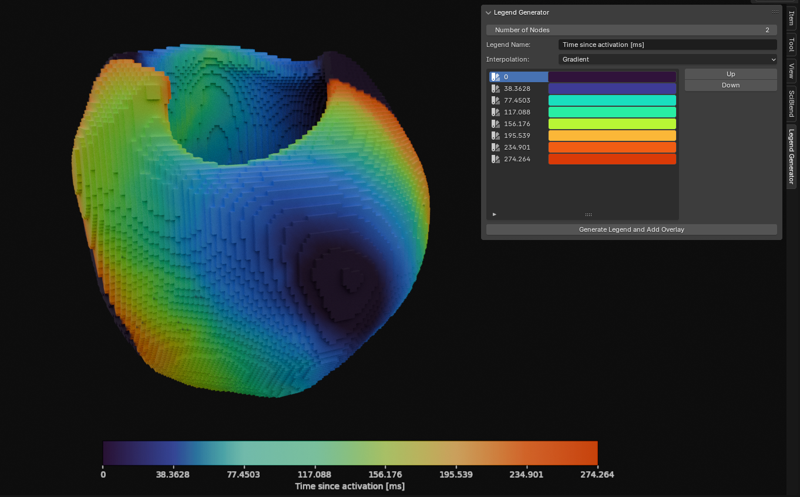

# SciBlend: Legend Generator for Blender

This script is an add-on for Blender 4.2 that allows users to create customized legends and overlay them onto their renders in real-time using Blender's compositor. Thanks to the powerful real-time compositor introduced in Blender 4.2, this add-on is particularly useful for scientific visualization, where precise and customizable legends are essential.




## Requirements

Before installing Blender and the add-on, ensure that you meet the following requirements:

1. **Operating System**: 
    - Linux (any recent distribution)
  
2. **Blender**:
    - Blender 4.2 or higher

3. **Python**:
    - Python 3.11 (bundled with Blender 4.2)

4. **Disk Space**:
    - At least 1 GB of free disk space for Blender installation and dependencies.

5. **Internet Connection**:
    - Required to download Blender, `matplotlib`, and other dependencies.
    
## Features

- **Customizable Legends**: Generate gradient-based legends with various interpolation methods.
- **Real-Time Compositing**: Integrate the legends directly into your renders using Blender's compositor.
- **Easy to Use**: Configure and apply legends directly within the Blender interface.

## Installation

### 1. Install Blender 4.2

To use this add-on, you need to have Blender 4.2 installed. Follow these steps to install Blender:

1. **Download Blender 4.2**:
    - Go to the official Blender website: [Blender Download](https://www.blender.org/download/).
    - Download the Blender 4.2 version for Linux (as a `.tar.xz` file).

2. **Extract Blender**:
    - Open a terminal and navigate to your Downloads directory:
      ```bash
      cd ~/Downloads
      ```
    - Create a directory for Blender and extract the downloaded file:
      ```bash
      sudo mkdir -p /opt/blender
      sudo tar -xvf blender-4.2-linux-x64.tar.xz -C /opt/blender/
      ```
    - Change the ownership of the Blender directory:
      ```bash
      sudo chown -R $USER:$USER /opt/blender
      ```

3. **Create a Symlink for Easy Access**:
    - Create a symbolic link to easily run Blender from the terminal:
      ```bash
      sudo ln -s /opt/blender/blender-4.2-linux-x64/blender /usr/local/bin/blender
      ```
    - Now you can run Blender simply by typing `blender` in your terminal.

### 2. Install `matplotlib`

To ensure the add-on functions correctly, you need to install `matplotlib` in Blender's Python environment:

1. **Ensure `pip` is Available**:
    - Run the following command to ensure `pip` is installed in Blender’s Python environment:
      ```bash
      /opt/blender/blender-4.2-linux-x64/4.2/python/bin/python3.11 -m ensurepip
      ```

2. **Install `matplotlib`**:
    - Install `matplotlib` using `pip` within Blender's Python environment:
      ```bash
      /opt/blender/blender-4.2-linux-x64/4.2/python/bin/python3.11 -m pip install --target=/opt/blender/blender-4.2.1-linux-x64/4.2/python/lib/python3.11/site-packages matplotlib
      ```
    - If you encounter warnings about existing directories or package conflicts, you can use the `--upgrade` option to ensure all packages are correctly installed:
      ```bash
      /opt/blender/blender-4.2-linux-x64/4.2/python/bin/python3.11 -m pip install --target=/opt/blender/blender-4.2.1-linux-x64/4.2/python/lib/python3.11/site-packages --upgrade matplotlib
      ```

### 3. Install the Add-on

1. **Package the Script**:
    - Place the provided script files into a folder named `LegendGenerator`.

2. **Install the Add-on in Blender**:
    - Open Blender and go to `Edit > Preferences > Add-ons`.
    - Click on `Install...` and select the `LegendGenerator` folder.
    - Enable the add-on by checking the box next to `Legend Generator`.

3. **Using the Add-on**:
    - Access the add-on from the `View3D` panel under the `Legend Generator` tab.
    - Configure your legend and add it to your composition.


## Usage

Once the add-on is installed and enabled, you can use it to generate and customize legends in Blender. Here’s a step-by-step guide on how to use the add-on:

### 1. Accessing the Legend Generator Panel

- Open Blender and switch to the `3D Viewport`.
- In the right sidebar, you will see a new tab called `Legend Generator`.
- Click on this tab to access the add-on's UI panel.

### 2. Configuring Your Legend

- **Number of Nodes**: Specify the number of color nodes for your gradient. This controls the complexity of the gradient used in the legend.
- **Legend Name**: Enter the name of the legend. This will appear as the label on the legend bar.
- **Interpolation Method**: Choose how the colors between nodes are interpolated. Options include:
  - **Linear**: Smooth transition between colors.
  - **Stair Step**: Abrupt changes between colors, useful for categorical data.
  - **Cubic**: Smooth cubic interpolation.
  - **Nearest**: Colors are assigned to the nearest node without interpolation.

### 3. Adding and Configuring Color Nodes

- In the `Legend Generator` panel, you will see a list of color nodes.
- For each node, you can set a color and an associated value (label).
- You can rearrange the nodes using the `Up` and `Down` buttons to adjust the order in the legend.

### 4. Generating the Legend

- Once configured, click the `Generate Legend and Add Overlay` button.
- The legend will be generated as an image and automatically added to your compositor in Blender.

### 5. Integrating the Legend into Your Render

- The generated legend will appear as a new image node in the compositor.
- You can position, scale, and composite the legend with your render using Blender's compositor tools.

## Contributing

Contributions are welcome! Feel free to open issues or submit pull requests to improve this project.
