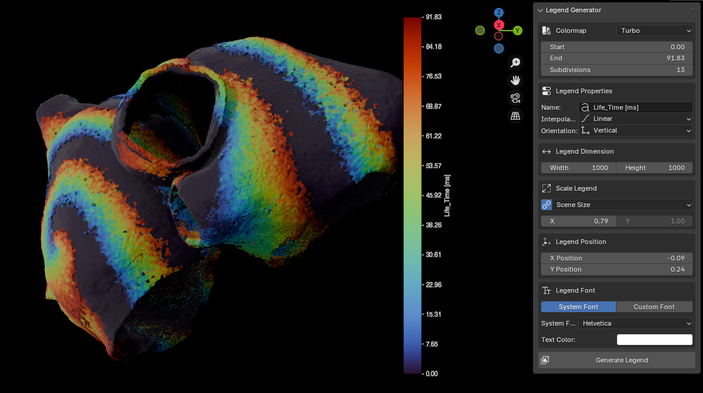

# SciBlend: Legend Generator for Blender v.2.0.1

This script is an add-on for Blender 4.2 that allows users to create customized legends and overlay them onto their renders in real-time using Blender's compositor. Thanks to the powerful real-time compositor introduced in Blender 4.2, this add-on is particularly useful for scientific visualization, where precise and customizable legends are essential.



## Table of Contents

1. [Requirements](#requirements)
2. [Features](#features)
3. [Installation](#installation)
   - [Important Note: Blender Installation](#important-note-blender-installation)
   - [Install Blender 4.2](#1-install-blender-42)
   - [Install `matplotlib`](#2-install-matplotlib)
   - [Install the Add-on](#3-install-the-add-on)
4. [Usage](#usage)
   - [Accessing the Legend Generator Panel](#1-accessing-the-legend-generator-panel)
   - [Configuring Your Legend](#2-configuring-your-legend)
   - [Adding and Configuring Color Nodes](#3-adding-and-configuring-color-nodes)
   - [Generating the Legend](#4-generating-the-legend)
   - [Integrating the Legend into Your Render](#5-integrating-the-legend-into-your-render)
5. [Contributing](#contributing)

## Requirements

Before installing Blender and the add-on, ensure that you meet the following requirements:

1. **Operating System**: 
    - Linux (any recent distribution)
  
2. **Blender**:
    - Blender 4.2 or higher

3. **Python**:
    - Python 3.11 (bundled with Blender 4.2)

4. **Disk Space**:
    - At least 1 GB of free disk space for Blender installation and dependencies.

5. **Internet Connection**:
    - Required to download Blender, `matplotlib`, and other dependencies.
    
## Features

- **Customizable Legends**: Generate gradient-based legends with various interpolation methods.
- **Real-Time Compositing**: Integrate the legends directly into your renders using Blender's compositor.
- **Easy to Use**: Configure and apply legends directly within the Blender interface.
- **Scientific Colormaps**: Choose from a variety of built-in scientific colormaps or use custom colors.
- **Flexible Positioning**: Easily adjust the position and scale of the legend in your render.
- **Font Customization**: Use system fonts or custom font files for legend text.
- **Text Color Control**: Adjust the color of the legend text to match your render style.
- **Orientation Options**: Create both horizontal and vertical legends.

## Installation

### Important Note: Blender Installation

**IMPORTANT**: When installing Blender, it is crucial to avoid using the Snap package version. The Snap version of Blender creates an isolated environment that prevents the installation of additional Python packages like `matplotlib`, which is essential for this add-on to function correctly.

Instead, please follow the manual installation instructions provided below to ensure that you can properly install and use all required dependencies.


---

### 1. Install Blender 4.2.1

Follow these steps to install Blender 4.2+ based on your operating system:

**Disclaimer**: The following commands are specifically for Blender 4.2.1. If you are using a different version of Blender, simply replace 4.2.1 with the version you are using (e.g., 4.2.0, 4.3.0, etc.).

#### For Linux:

1. **Download Blender 4.2.1**:
    - Go to the official Blender website: [Blender Download](https://www.blender.org/download/).
    - Download the Blender 4.2.1 version for Linux (as a `.tar.xz` file).

2. **Extract Blender**:
    - Open a terminal and navigate to your Downloads directory:
      ```bash
      cd ~/Downloads
      ```
    - Create a directory for Blender and extract the downloaded file:
      ```bash
      sudo mkdir -p /opt/blender
      sudo tar -xvf blender-4.2.1-linux-x64.tar.xz -C /opt/blender/
      ```
    - Change the ownership of the Blender directory:
      ```bash
      sudo chown -R $USER:$USER /opt/blender
      ```

3. **Create a Symlink for Easy Access**:
    - Create a symbolic link to run Blender easily from the terminal:
      ```bash
      sudo ln -s /opt/blender/blender-4.2.1-linux-x64/blender /usr/local/bin/blender
      ```
    - Now you can run Blender by typing `blender` in your terminal.

#### For macOS:

1. **Download Blender 4.2.1**:
    - Go to the official Blender website: [Blender Download](https://www.blender.org/download/).
    - Download the Blender 4.2.1 version for macOS.

2. **Install Blender**:
    - Open the `.dmg` file and drag Blender to your `Applications` folder.

3. **Run Blender**:
    - You can launch Blender directly from the `Applications` folder or by typing `open /Applications/Blender.app` in the terminal.

#### For Windows:

1. **Download Blender 4.2.1**:
    - Go to the official Blender website: [Blender Download](https://www.blender.org/download/).
    - Download the Blender 4.2.1 installer for Windows.

2. **Install Blender**:
    - Run the `.exe` installer and follow the installation prompts.

3. **Add Blender to PATH** (Optional):
    - If you want to run Blender from the command line, make sure to check the option to add Blender to your system's PATH during installation. Alternatively, you can manually add the Blender installation directory to the PATH environment variable.

4. **Run Blender**:
    - You can launch Blender from the Start menu or by typing `blender` in the command prompt (if added to PATH).


### 2. Install `matplotlib`


To ensure the add-on functions correctly, you need to install `matplotlib` in Blender's Python environment. The steps are the same across Linux, macOS, and Windows:

1. **Ensure `pip` is Available**:
    - Run the following command to ensure `pip` is installed in Blender's Python environment (replace the path with your Blender 4.2.1 installation path):

      ```bash
      <path_to_blender>/4.2.1/python/bin/python3.11 -m ensurepip
      ```

2. **Install `matplotlib`**:
    - Install `matplotlib` using `pip` within Blender’s Python environment. Be sure to target Blender's Python `site-packages` folder:

      ```bash
      <path_to_blender>/4.2.1/python/bin/python3.11 -m pip install --target=<path_to_blender>/4.2.1/python/lib/python3.11/site-packages matplotlib
      ```

3. **Upgrade if Necessary**:
    - If you encounter package conflicts or warnings, use the `--upgrade` flag:

      ```bash
      <path_to_blender>/4.2.1/python/bin/python3.11 -m pip install --target=<path_to_blender>/4.2.1/python/lib/python3.11/site-packages --upgrade matplotlib
      ```


### 3. Install the Add-on

1. **Package the Script**:
    - Place the provided script files into a folder named `LegendGenerator`.

2. **Install the Add-on in Blender**:
    - Open Blender and go to `Edit > Preferences > Add-ons`.
    - Click on `Install...` and select the `LegendGenerator` folder.
    - Enable the add-on by checking the box next to `Legend Generator`.

3. **Using the Add-on**:
    - Access the add-on from the `View3D` panel under the `Legend Generator` tab.
    - Configure your legend and add it to your composition.

## Usage

Once the add-on is installed and enabled, you can use it to generate and customize legends in Blender. Here's a step-by-step guide on how to use the add-on:

### 1. Accessing the Legend Generator Panel

- Open Blender and switch to the `3D Viewport`.
- In the right sidebar, you will see a new tab called `Legend Generator`.
- Click on this tab to access the add-on's UI panel.

### 2. Configuring Your Legend

- **Number of Nodes**: Specify the number of color nodes for your gradient. This controls the complexity of the gradient used in the legend.
- **Legend Name**: Enter the name of the legend. This will appear as the label on the legend bar.
- **Interpolation Method**: Choose how the colors between nodes are interpolated. Options include:
  - **Linear**: Smooth transition between colors.
  - **Stair Step**: Abrupt changes between colors, useful for categorical data.
  - **Cubic**: Smooth cubic interpolation.
  - **Nearest**: Colors are assigned to the nearest node without interpolation.
- **Orientation**: Choose between horizontal and vertical legend orientation.
- **Colormap**: Select from built-in scientific colormaps or use custom colors.
- **Colormap Range**: Set the start and end values for the colormap and adjust the number of subdivisions.

### 3. Adding and Configuring Color Nodes

- In the `Legend Generator` panel, you will see a list of color nodes.
- For each node, you can set a color and an associated value (label).
- You can rearrange the nodes using the `Up` and `Down` buttons to adjust the order in the legend.
- When using a scientific colormap, the color nodes will be automatically generated based on your settings.

### 4. Customizing Legend Appearance

- **Legend Dimension**: Set the width and height of the legend in pixels.
- **Scale**: Adjust the scale of the legend relative to the scene or render size. You can link or unlink X and Y scaling.
- **Position**: Set the X and Y position of the legend in your render.
- **Font**: Choose between system fonts or a custom font file for the legend text.
- **Text Color**: Set the color of the legend text to match your render style.

### 5. Generating the Legend

- Once configured, click the `Generate Legend` button.
- The legend will be generated as an image and automatically added to your compositor in Blender.

### 6. Integrating the Legend into Your Render

- The generated legend will appear as a new image node in the compositor.
- The add-on automatically sets up the necessary nodes to overlay the legend on your render.
- You can further adjust the position and scale of the legend using the controls in the Legend Generator panel.

## Contributing

Contributions are welcome! Feel free to open issues or submit pull requests to improve this project.
